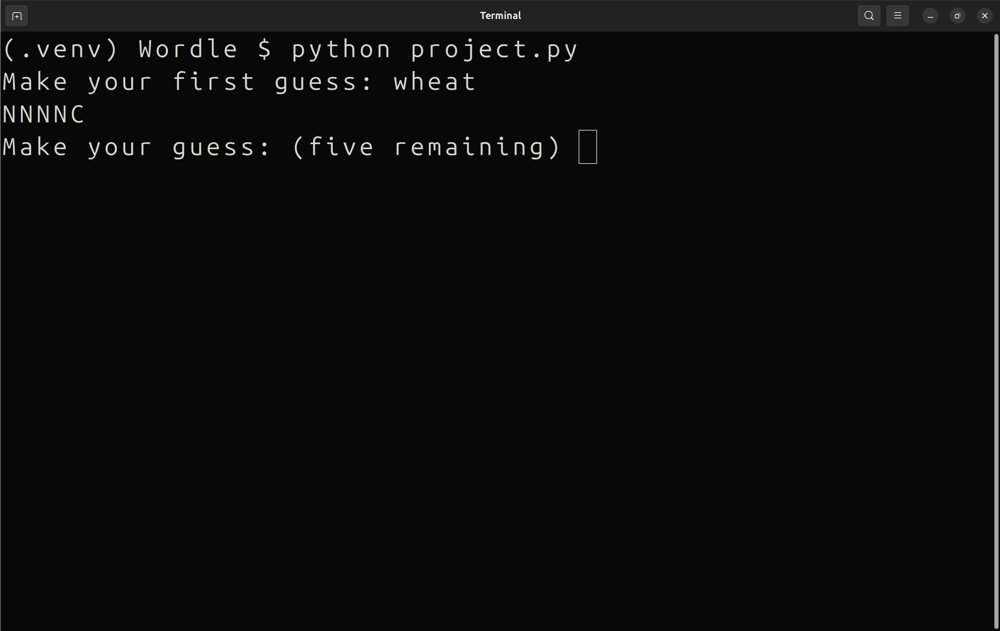
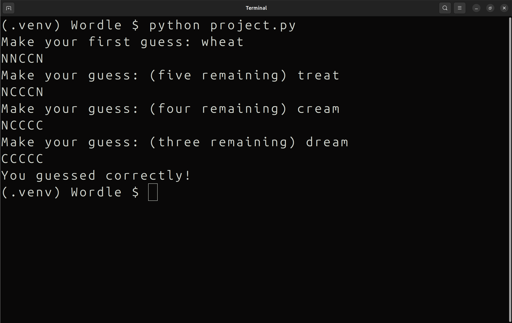
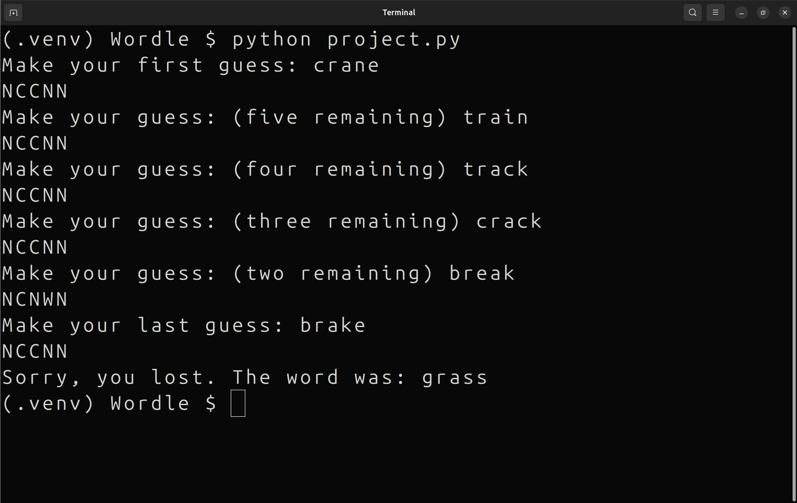

<h1 align="center">Wordle</h1>

#### Video Demo: TODO
#### Description:

A simple **word-guessing game** implemented in Python.

This project is a terminal-based game inspired by the popular game **Wordle**, where the player has **6 attempts** to guess a hidden, **randomly generated five-letter** word.

The game randomly chooses a word from a **thirty-element list** of predefined words and asks the player to make guesses. If the player guesses the word correctly, the game ends with a **victory message**. However, if all six attempts are used without guessing the right word, the game ends with a **loss message**.

After each guess the game provides some **hints** using these letters:
 
- **C** — the letter is correct and in the right position
- **W** — the letter **is** in the word but in the wrong position
- **N** — the letter **does not** exist in the word 

### Screenshots

<p align="center">
  
  
  
</p>


### How to Run:

1. Install requirements:
   ```bash
   pip install -r requirements.txt
2. Run the game:
   ```bash
   python project.py

### How to play:

1. Type a **5-letter** word and press Enter.
2. You have **6 attempts**, so try not to waste them.
3. After each guess, you will receive a **hint** made of 'C', 'W', and 'N':
   - 'C': correct letter at the right position
   - 'W': letter is in the word but isn't at the right position
   - 'N': letter is not in the word

### Testing

Tests are written in **test_project.py** and use `pytest`.

```bash
pytest test_project.py

